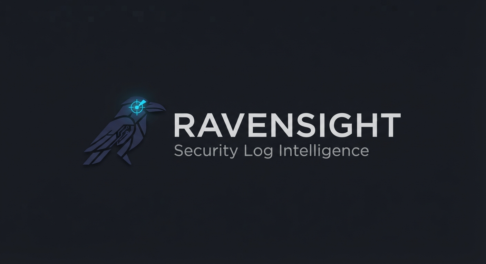

<p align="center">
  <picture>
    <source media="(prefers-color-scheme: dark)" srcset="docs/ravensight-logo-dark.jpg">
    <source media="(prefers-color-scheme: light)" srcset="docs/ravensight-logo-light-half.jpg">
    
  </picture>
</p>

# Ravensight — Wazuh Security Log Analyser

A local-first security log analyser that pulls alerts from the Wazuh REST API,
analyses them using a local LLM (Qwen3 via llama.cpp), and generates structured
markdown security reports with baseline memory tracking and historical trending.

> Named for Huginn and Muninn, Odin's ravens — sent out each day to watch the
> world and report back what they see. Ravensight does the same for your logs.

---

## What It Does

- Connects to the **Wazuh Indexer (OpenSearch)** to pull security alerts by time range,
  agent, or severity level
- Analyses alert patterns using a **local Qwen3 model** — no data leaves
  your network
- Generates **markdown security reports** summarising threats, anomalies, and
  recommended actions
- Maintains a **baseline memory** of normal behaviour so repeated noise is
  distinguished from genuine alerts
- Tracks **historical alert trends** per rule group — surfaces slow-burn threats
  that single-run baseline comparison misses
- Tags findings against **MITRE ATT&CK** and the **ASD Essential Eight / ISM**
  for Australian-aligned reporting
- Retrieves **similar past incidents** via a local ChromaDB vector store for
  semantic context
- Runs on a local homelab — designed for self-hosted Wazuh deployments

---

## Architecture

```
main.py               # Entry point — CLI and orchestration
ravensight/
├── wazuh_client.py    # Wazuh Indexer (OpenSearch) REST API client
├── analyser.py        # LLM analysis via llama.cpp OpenAI-compatible API
├── reporter.py        # Markdown report generation
├── baseline.py        # Baseline memory persistence (JSON store)
├── trending.py        # Historical trend analysis and anomaly detection
└── embedder.py        # ChromaDB vector store and embedding client
scripts/
├── mitre_sync.py      # MITRE ATT&CK dataset sync
└── asd_sync.py        # ASD Essential Eight / ISM dataset sync
```

---

## Requirements

| Dependency | Purpose |
|------------|---------|
| Python 3.11+ | Runtime (tomllib requires 3.11+) |
| `requests` | Wazuh Indexer REST API calls |
| `openai` | llama.cpp OpenAI-compatible client |
| `chromadb` | Vector store for semantic alert retrieval |
| `tqdm` | Progress bars for embedding and sync operations |
| Wazuh 4.x | Alert source (self-hosted) |
| llama.cpp server (port 8080) | Local LLM inference (Qwen3) |
| llama.cpp server (port 8081) | Embedding model inference (Qwen3-Embedding-0.6B) |

---

## Setup

### 1. Clone the repo

```bash
git clone git@github.com:sli3/Ravensight.git
cd Ravensight
```

### 2. Choose how to run Ravensight

- **[Docker](#docker)** — no local Python setup needed; skip straight to that
  section
- **Manual / virtual environment** — continue with the steps below

---

### Manual setup

#### 1. Create a virtual environment

```bash
uv venv --python 3.11
source .venv/bin/activate
uv pip install -r requirements.txt
```

Or with standard venv:

```bash
python3 -m venv .venv
source .venv/bin/activate
pip install -r requirements.txt
```

#### 2. Configure

Copy the example config and fill in your values:

```bash
cp config.example.toml config.toml
```

| Key | Description |
|-----|-------------|
| `wazuh.host` | Your Wazuh manager hostname or IP |
| `wazuh.port` | Wazuh API port (default: 55000) |
| `wazuh.user` | Wazuh API username |
| `wazuh.password` | Wazuh API password |
| `wazuh.indexer_host` | Wazuh Indexer (OpenSearch) IP — often same as manager |
| `wazuh.indexer_port` | Indexer port (default: 9200) |
| `wazuh.indexer_user` | Indexer username (default: admin) |
| `wazuh.indexer_password` | Indexer password |
| `llm.base_url` | llama.cpp server URL (e.g. `http://yubaba:8080/v1`) |
| `llm.model` | Model ID served by llama.cpp (e.g. `Qwen3`) |
| `llm.api_key` | Any string — llama.cpp does not validate |
| `reports.output_dir` | Where to write markdown reports |
| `baseline.path` | Path to the baseline JSON file |

#### Embedding Model Configuration

Ravensight uses a separate embedding model server for semantic retrieval:

| Key | Description | Example |
|-----|-------------|---------|
| `embeddings.endpoint` | URL of the embedding model server | `http://localhost:8081/v1` |
| `embeddings.model` | Model ID served by the embedding server | `Qwen3-Embedding-0.6B` |
| `embeddings.chroma_db_path` | Path to ChromaDB vector store | `data/chroma/embedded` |
| `embeddings.top_k` | Number of similar incidents to retrieve | `5` |

> **Note:** The Wazuh Indexer must be accessible on port 9200 from the machine
> running Ravensight. If your indexer is bound to localhost only, update
> `network.host` in `/etc/wazuh-indexer/opensearch.yml` to `0.0.0.0` and
> restart the indexer service.

#### 3. Run

```bash
python main.py --hours 24
```

---

---

## Docker

Ravensight can also be run in a container instead of a local virtual environment.
This is an alternative to the manual setup above — you don't need both.

### 1. Build the image

```bash
docker build -t ravensight .
```

### 2. Configure

Docker reads configuration from environment variables rather than a `config.toml`
file you edit directly. Create a `.env` file listing the variables below with
your real values (an `.env.example` template is planned — see the note at the
end of this section).

The container's entrypoint script substitutes these variables into
`config.template.toml` and writes a real `config.toml` inside the container at
start-up — you never need to hand-edit a config file when running in Docker.

| Variable | Required | Description |
|----------|----------|--------------|
| `WAZUH_HOST` | ✅ | Wazuh manager hostname or IP |
| `WAZUH_PORT` | | Wazuh API port (default: `55000`) |
| `WAZUH_API_USER` | ✅ | Wazuh API username |
| `WAZUH_API_PASSWORD` | ✅ | Wazuh API password |
| `WAZUH_INDEXER_HOST` | ✅ | Wazuh Indexer (OpenSearch) IP |
| `WAZUH_INDEXER_PORT` | | Indexer port (default: `9200`) |
| `WAZUH_INDEXER_USER` | | Indexer username (default: `admin`) |
| `WAZUH_INDEXER_PASSWORD` | ✅ | Indexer password |
| `LLM_BASE_URL` | ✅ | llama.cpp server URL (e.g. `http://yubaba:8080/v1`) |
| `LLM_MODEL` | ✅ | Model ID served by llama.cpp |
| `LLM_API_KEY` | | Any string — llama.cpp does not validate (default: `local`) |
| `LLM_TEMPERATURE` | | (default: `0.3`) |
| `LLM_MAX_TOKENS` | | (default: `1024`) |
| `EMBEDDINGS_ENDPOINT` | ✅ | Embedding model server URL (e.g. `http://yubaba:8081/v1`) |
| `EMBEDDINGS_MODEL` | | (default: `Qwen3-Embedding-0.6B`) |
| `EMBEDDINGS_TOP_K` | | (default: `5`) |
| `TRENDING_WINDOW_DAYS` | | (default: `30`) |
| `TRENDING_OUTPUT_STANDALONE` | | (default: `false`) |
| `RAVENSIGHT_DATA_DIR` | | Path inside the container for data files (default: `/app/data`) |
| `RAVENSIGHT_REPORTS_DIR` | | Path inside the container for reports (default: `/app/reports`) |

Required variables with no value set will cause the container to exit
immediately with a clear error at start-up, rather than fail later with a
confusing placeholder value baked into `config.toml`.

### 3. Run

```bash
docker run \
  --env-file .env \
  -v ./data:/app/data \
  -v ./reports:/app/reports \
  ravensight
```

On first start, if `data/mitre_attack.json` or `data/asd_framework.json` are
missing, the container automatically runs the corresponding sync script before
the main analysis — the same one-time sync described in the ASD/MITRE sections
below. Subsequent starts skip the sync unless those files are deleted.

A default `e8_keyword_overrides.json` and `platform_hints.json` are seeded into
the mounted `data/` volume on first start if you haven't provided your own —
edit them directly in your mounted `data/` folder afterwards; the container
never overwrites an existing file there.

### Forcing a re-sync

MITRE ATT&CK and the ASD ISM are both revised periodically. To force a re-sync
of both reference datasets on demand — without deleting the existing files
first — pass `sync` as the container command:

```bash
docker run --env-file .env -v ./data:/app/data ravensight sync
```

This refreshes both `mitre_attack.json` and `asd_framework.json` regardless of
whether they already exist, then exits.

### Passing extra flags to the analysis run

Anything else after the image name overrides the default command, but still
runs through the same start-up checks:

```bash
docker run --env-file .env -v ./data:/app/data -v ./reports:/app/reports ravensight \
  python3 main.py --config /app/config.toml --hours 1 --level 12
```

> **Note:** `docker-compose.yml` support, with configurable host-side bind mount
> paths, is planned as a follow-up — see the project roadmap.

---

## Usage

```
usage: main.py [-h] [--config CONFIG] [--hours N] [--agent AGENT]
                [--level LEVEL] [--log-level LEVEL] [--report-only]

options:
  --config PATH    Path to config file (default: config.toml)
  --hours N        Analyse alerts from the last N hours (default: 24)
  --agent AGENT    Filter to a specific agent name or ID
  --level LEVEL    Minimum alert level to include (default: 7)
  --log-level      Logging verbosity: DEBUG, INFO, WARNING, ERROR (default: INFO)
  --report-only    Generate report from last baseline without re-querying Wazuh
```

### Example output

```
2026-09-22 06:39:00 - INFO - Fetched 9984 alerts from Wazuh Indexer
2026-09-22 06:39:00 - INFO - Updated baseline with 2 findings
2026-09-22 06:39:01 - INFO - Report written to reports/2026-09-22_security_report.md
```

---

## Reports

Reports are saved to the `reports/` directory as markdown files, named by date.
Each report contains, in order:

- **Summary** — overall threat posture for the period
- **Findings** — LLM-identified threats and patterns grouped by rule group
- **Similar Past Incidents** — related historical findings retrieved via the
  ChromaDB vector store
- **MITRE ATT&CK Tags** — tactics and techniques mapped to the period's findings
- **Historical Trends** — slow-burn anomalies flagged across recent runs
- **Recommendations** — LLM-generated response suggestions

---

## Baseline Memory

Ravensight tracks a baseline of findings and recommendations from previous runs.
On each run, the current analysis updates the baseline. The `--report-only` flag
generates a report from the last saved baseline without querying Wazuh or the LLM.

The baseline is stored as a JSON file at the path configured in `config.toml`.

---

## Historical Trending

`trending.py` tracks per-rule-group alert volumes across runs and detects
slow-burn threats that single-run baseline comparison misses.

- Each run appends a timestamped snapshot of rule group counts to the scan history
- `trending.py` reads the history over a configurable rolling window (default 30 days)
- Rule groups with consistently increasing counts across 3+ consecutive runs are
  flagged as anomalies with a ⚠️ marker
- Output is a markdown table embedded in the main report or written as a
  standalone `reports/trending_YYYY-MM-DD.md`

---

## MITRE ATT&CK & ASD Essential Eight / ISM

Findings are tagged against the **MITRE ATT&CK** framework and Australia's
**ASD Essential Eight** and **ISM** controls.

- `scripts/mitre_sync.py` pulls the MITRE ATT&CK enterprise dataset (STIX JSON)
  to `data/mitre_attack.json`
- `scripts/asd_sync.py` pulls the ASD ISM catalog (OSCAL JSON) to
  `data/asd_framework.json`
- Both datasets are synced once and used fully offline afterwards — re-run the
  sync scripts manually (or `docker run ravensight sync` in Docker) to pick up
  a new release
- `data/e8_keyword_overrides.json` reduces Essential Eight scoring false
  positives via a keyword blocklist
- `data/platform_hints.json` is a hand-edited false-positive hint table

---

## Roadmap

| Feature | Status | Notes |
|---------|--------|-------|
| MITRE ATT&CK Tagging | ✅ Done | `mitre_sync.py` — fully offline after initial sync |
| ASD Essential Eight / ISM Mapping | ✅ Done | `asd_sync.py` — OSCAL JSON source |
| Semantic Similar-Incident Retrieval | ✅ Done | ChromaDB + Qwen3-Embedding-0.6B |
| Historical Trending | 🔧 In progress | `trending.py` written — baseline schema extension and wiring pending |
| Docker packaging | 🔧 In progress | Core container done; `docker-compose.yml` + service profiles planned |
| Multi-Model Routing | 📋 Planned | Two-pass pipeline — smaller triage model → deep analysis model |

Full design notes for each feature are in [`docs/RAVENSIGHT_ROADMAP.md`](docs/RAVENSIGHT_ROADMAP.md).

---

## Inference Server

Ravensight is designed to run against a dedicated local llama.cpp inference node.
All LLM calls are made over the local LAN via the OpenAI-compatible REST API.
No data is sent to any cloud service.

See [`docs/yubaba-server-reference.md`](docs/yubaba-server-reference.md) for
the full server specification (gitignored — contains local network details).

---

## Development Workflow

This project uses the [Huginn](https://github.com/sli3/Huginn) OpenCode workflow
template — structured sessions, safety gates, and session memos.

```
Ravensight/
├── main.py
├── ravensight/
│   ├── wazuh_client.py
│   ├── analyser.py
│   ├── reporter.py
│   ├── baseline.py
│   ├── trending.py
│   └── embedder.py
├── scripts/
│   ├── mitre_sync.py
│   └── asd_sync.py
├── tests/
├── data/
│   ├── defaults/             # Seed files baked into the Docker image
│   │   ├── e8_keyword_overrides.json
│   │   └── platform_hints.json
│   ├── mitre_attack.json     # Gitignored — regenerable via mitre_sync.py
│   ├── asd_framework.json    # Gitignored — regenerable via asd_sync.py
│   ├── baseline_state.json   # Gitignored
│   └── chroma/embedded/      # Gitignored — vector store
├── reports/                  # Gitignored — generated output
├── config.example.toml
├── config.template.toml      # Docker — substituted at container start
├── docker-entrypoint.sh
├── Dockerfile
├── requirements.txt
├── docs/
│   └── RAVENSIGHT_ROADMAP.md
├── AGENTS.md
├── opencode.json
├── LICENSE
├── .gitignore
├── .session-memos/           # Gitignored working notes
└── .opencode/
    ├── agents/
    ├── commands/
    └── skills/
```

---

## Licence

MIT — see [LICENSE](LICENSE)